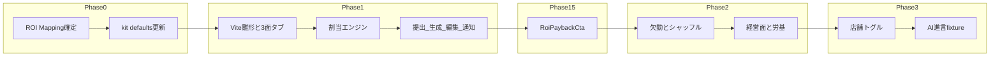

# シフト管理デモ 実装 PLAN

正本ドキュメント:

- 要件: [../40_シフト管理デモ_要件定義書.md](../40_シフト管理デモ_要件定義書.md)
- Definition: [shift_demo_definition.md](./shift_demo_definition.md)
- ROI: [roi-mapping.md](./roi-mapping.md)
- CTA手順: [../../roi-simulator/docs/demo-roi-integration-playbook.md](../../roi-simulator/docs/demo-roi-integration-playbook.md)
- トークン参照: [../../dd_demo/docs/31_dd_demo_UIUXデザイン要件書.md](../../dd_demo/docs/31_dd_demo_UIUXデザイン要件書.md)（`--brass` を `#C97B3D` に置換）

---

## 確定方針

| 項目 | 決定 |
|---|---|
| スタック | Vite 6 + React 19 + TypeScript。Core は Phase 1〜3 で入れない |
| スタイル | DDトークンを CSS 変数で移植。シグネチャ `--ember: #C97B3D`。Tailwind 不使用 |
| データ | `41_みなと屋_サンプルデータ.json` → `src/data/minatoya.json` |
| 割当 | フロント決定的エンジン。不足枠は空欄＋赤バッジ |
| F-08 | シナリオ固定文のみ（Core / BYOK は本 PLAN 外） |
| ROI kit | 既存 `shift-management.json` の `roi.defaults` のみ更新 |
| CTA | `product_flow` の `roiLink` / `RoiPaybackCta` をコピーして差し替え |

---

## Phase 0 — ROI 契約確定

1. `shift-management.json` の `roi.defaults` → `people:3`, `cases:5`, `minutes:90`, `reduction:80`
2. `roi-mapping.md` ステータスを確定
3. `.env.example` に `VITE_ROI_SIMULATOR_URL=`

完了条件: URL `kit=shift-management&industry=other&cat=dashboard&from=shift-minatoya` が一貫。

---

## Phase 1 — 核体験

- Vite 雛形・トークン・DemoStore・3面タブ
- F-02 / F-03 店長面（週ビュー・最適案・編集・確定）
- スタッフ面（希望提出・通知・既読）+ F-04
- タイムカウンター骨格

完了条件: 台本 §7-1〜3 が通る。

---

## Phase 1.5 — 投資回収 CTA

- `roiLink.ts` / `RoiPaybackCta` / CSS
- 主CTA: 当初は確定後に仮置き → Phase 2 で経営面へ移動
- README

---

## Phase 2 — 欠勤・シャッフル・経営面

- F-05 / F-06 / F-07
- 経営面ダッシュボード + 主CTAをタイムカウンター直下へ

---

## Phase 3 — スケールと進言

- 店舗トグル 1 / 3 / 8 + 増設ボタン
- F-08 fixture（シナリオ注記付き）

---

## 明示的 Won't

- `@axeon/ai-demo-core` / Trial / BYOK
- 実 LINE・メール・勤怠連携
- デモ内 ROI 金額計算・iframe
- 10店舗・150名超の保証
